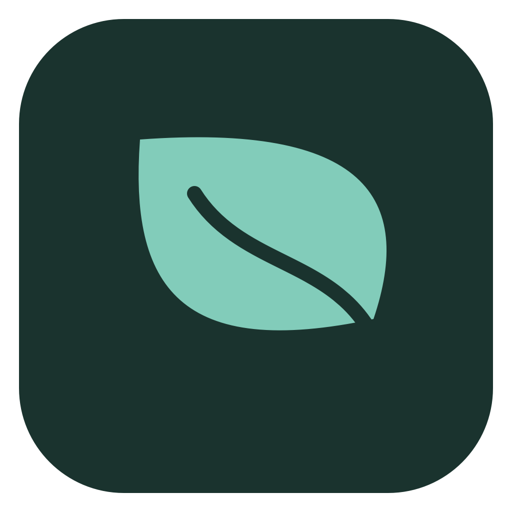

<div align="center">

<h1>Plam</h1>
<p>A quieter way to learn code. A better way to remember it.</p>
<p>Free, open-source learning software for your Mac. Bring your own AI model.</p>
<p><a href="https://REDDITARUN.github.io/palm/">Website</a> · <a href="https://github.com/REDDITARUN/palm/releases/latest">Download for Mac</a> · <a href="docs/GETTING_STARTED.md">Get started</a> · <a href="docs/ARCHITECTURE.md">Architecture</a></p>
</div>

## Learn from questions. Learn from your code.

Pick a technical topic or a repository. Plam builds a learning path, explains ideas with examples, and gives you practice that asks you to think. Keep editable notes, ask a tutor about the part that does not click, and return to earlier ideas through spaced review.

- **Generated courses:** concepts, subtopics, checkpoints, reading, worked examples, and mixed questions.
- **Practice with feedback:** choices, true/false, fill-in-the-blank, code tracing, explanations, debugging, ordering, transfer, and flow-diagram choices. Written answers use model-based grading.
- **A connected notebook:** block editing, Markdown, code, math, diagrams, highlights, note links, flashcards, revisions, and a side tutor.
- **A daily learning habit:** next steps across courses, optional reminders, activity history, achievements, and a pixel tree that grows with practice.
- **Repository understanding:** saved source snapshots, code selections, optional Serena symbol exploration, and source-linked lessons.
- **Your models, your library:** OpenRouter, OpenAI, compatible endpoints, Keychain credentials, SQLite storage, and portable backups.

## Install

Requires **Apple silicon (M1 or later), macOS 15 or later**. Intel and iOS builds are not included.

1. Download `Plam-1.0.0-macOS-arm64.dmg` from [Releases](https://github.com/REDDITARUN/palm/releases/latest).
2. Open the disk image and drag **Plam** into **Applications**.
3. Open Plam, add your own API key, and choose a topic.

The community build is **ad-hoc signed and not notarized**. If macOS blocks the first launch, attempt to open it, then use **System Settings → Privacy & Security → Open Anyway** for the copy you downloaded from this repository. See [Apple's per-app approval instructions](https://support.apple.com/en-us/102445). Release assets include SHA-256 checksums. No installer script disables Gatekeeper.

## Start with a free model

Choose **OpenRouter** during onboarding, [create an API key](https://openrouter.ai/settings/keys), and paste it into Plam. The default is `thinkingmachines/inkling:free`; you may choose another free or paid model in Settings. Inkling uses the actual OpenCode learning harness, prepared on first use with a one-time local tools download.

**Plam costs nothing. Model pricing and rate limits belong to your provider.** Plam does not silently switch a free model to a paid one. Inkling's free endpoint logs prompts and outputs for model improvement and does not allow confidential/personal data. Read its [current model terms](https://openrouter.ai/thinkingmachines/inkling:free) before using it. For private material, choose a provider and settings appropriate to your needs.

OpenAI works with an [OpenAI API key](https://platform.openai.com/api-keys); API billing is separate from ChatGPT. Custom OpenAI-compatible endpoints are available in Settings.

## Connect GitHub (optional)

Open **Repositories**, paste `https://github.com/owner/repository`, and choose **Import from GitHub**. Public repositories need no token. For a private repository, add a fine-grained token with read-only **Contents** permission for that repository in **Settings → Local tools**. GitHub cloning needs Apple's command-line tools. You can instead extract a repository ZIP and use **Open folder**.

See the [GitHub guide](docs/GITHUB.md) for detailed steps. Repository imports filter common secret files; they are not a comprehensive secret scanner.

## Local data and offline use

Your library is stored in `~/Library/Application Support/Plam/`. Keys live separately in macOS Keychain. Selected context is sent to your chosen AI provider; local storage does not mean all computation is offline. Saved notes, lessons, and choice/ordering practice work offline. Generating lessons, tutor answers, and grading written responses require the configured model connection.

**Settings → Data → Back up library** exports records and source snapshots together. Credentials and downloaded tools are excluded. See [data and privacy](docs/DATA_AND_PRIVACY.md).

## Build and contribute

Use a Mac with Xcode (the project is tested with Xcode 26 / Swift 6). Node 22+ is needed when rebuilding the embedded editor.

```sh
git clone https://github.com/REDDITARUN/palm.git
cd palm
swift test
bash Scripts/build-native.sh --release
open dist/Plam.app
```

The prebuilt editor is committed for native-only development. For editor changes:

```sh
cd Editor
npm ci
npm run typecheck
npm test
npm run build
```

[Development guide](docs/DEVELOPMENT.md) · [Contributing](CONTRIBUTING.md) · [Agent instructions](AGENTS.md) · [Architecture decisions](docs/adr/README.md) · [Release guide](docs/RELEASING.md) · [Changelog](CHANGELOG.md)

## License

Original Plam code is [MIT licensed](LICENSE). Third-party components retain their own licenses, including BlockNote's MPL-2.0 components. See [third-party notices](THIRD_PARTY_NOTICES.md); the app also bundles dependency license texts. AI services have separate terms.
