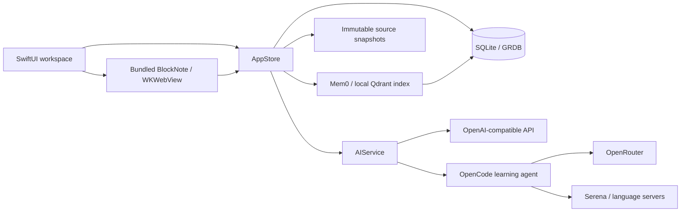

# Architecture

Plam is a local-first macOS application with a cloud-compatible AI boundary. SQLite holds the authoritative learning library. Model providers generate and grade learning artifacts; optional local tools explore saved code and index learning memory.

## Boundaries

- **PlamCore:** Codable models, database transactions/revisions, source import/filtering, prompts and response validation, scheduling, daily planning, graph indexing/layout, and process/runtime services.
- **Plam:** observable application state, SwiftUI screens and navigation, Keychain interactions, AppKit graph/input bridges, notifications, packaging-facing resources.
- **Editor:** React/BlockNote source built into a single bundled HTML artifact. WKWebView messages carry note identity and revision so late edits cannot target a different note.
- **Optional runtime:** pinned installer bootstraps Python, OpenCode, Serena, Mem0, and local embeddings into the user's Application Support directory. No personal runtime cache ships in releases.

## Learning flow

Topic/repository → diagnostic → generated outline → lesson with examples and mixed questions → attempts, hints, tutor questions → reflection and recap → saved note, course completion, and FSRS review scheduling. Generation outputs are validated and bounded repair attempts can correct malformed structure. Transport failures do not become incorrect answers.

Local graph links come from note links, course ownership, and saved learning memories. Shared-tag suggestions are labeled as suggestions, not invented evidence. Graph camera state lives in the native canvas to keep pointer interaction out of SwiftUI's inspector updates.

See [ADRs](adr/README.md) for tradeoffs, [data/privacy](DATA_AND_PRIVACY.md) for persistence, and [development](DEVELOPMENT.md) for builds and tests.
