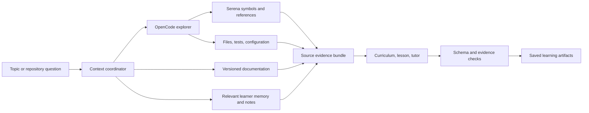

# Palm — complete Mac learning app blueprint

Decision date: 2026-09-05. Status: researched architecture and product specification; implementation and integration benchmarks have not been performed.

The companion [learning design](LEARNING_DESIGN.md) grounds the educational workflow in primary studies and specifies teaching, question-generation, adaptation, and evaluation policies. Its more detailed learning requirements supplement this blueprint.

## Product commitment

A personal, native Mac app for learning technical concepts and understanding repositories. Both learning modes have the same complete workflow: diagnosis, a generated curriculum, lessons, practice, contextual questions, notes, checkpoints, and spaced review. All subjects and materials are generated from the learner's request and relevant sources. We build reusable teaching and assessment structures, not a fixed content catalogue.

The app and its storage run locally. Cloud AI calls with the user's API key are allowed. Phone apps, synchronization, hosted databases, and a hosted application backend are outside the current requested scope. Existing lessons, notes, objective quizzes, and the review schedule remain available without a network connection; new generation and AI evaluation require the configured provider.

This document specifies one complete product. The implementation workstreams below are dependencies within that product, not feature deferrals to future versions.

## Technology decisions

| Responsibility | Choice | Reason |
| --- | --- | --- |
| Mac application | Swift + SwiftUI; AppKit for text editing | Native navigation, keyboard behavior, accessibility, selection, and window management |
| UI consistency | Apple controls plus an app-owned LearningUI component library | One typography, spacing, state, and interaction system across every screen |
| Durable data | SQLite through GRDB; FTS5 for text search | Explicit transactions and migrations for learning history, notes, and resumable work |
| Repository exploration | OpenCode headless server | Existing agent runtime and tool/session machinery |
| Semantic code context | Serena over MCP, with language servers | Symbol and reference navigation rather than relying solely on text similarity |
| Current technical references | Context7 plus direct official documentation retrieval | Ground lessons in the relevant dependency version and source material |
| Structured lessons and tutor responses | MacPaw/OpenAI behind an app-owned provider interface | Swift streaming and API integration; separate provider transport from learning policy |
| Derived learner memory | Mem0 OSS in an app-managed Python helper | Retrieve relevant past doubts, preferences, and explanations |
| Memory vector persistence | Qdrant Python client, persistent local mode | No separate database server for this personal memory corpus |
| Notes and lesson reading | Textual | Native rich text presentation |
| Notes editing | SwiftMarkdownEngine behind an app-owned editor interface | Native Markdown editing with links, code, and embedded content |
| Interactive code viewer | CodeEditSourceEditor | Native source view backed by Tree-sitter |
| Review scheduling | swift-fsrs | Reuse the FSRS implementation; own its integration with assessment evidence |
| Credentials | macOS Keychain | Keep provider credentials out of ordinary application records |

Primary references: [GRDB](https://github.com/groue/GRDB.swift), [OpenCode server](https://opencode.ai/docs/server/), [Serena](https://github.com/oraios/serena), [Context7](https://github.com/upstash/context7), [MacPaw/OpenAI](https://github.com/MacPaw/OpenAI), [Mem0](https://github.com/mem0ai/mem0), [Qdrant client](https://github.com/qdrant/qdrant-client), [Textual](https://github.com/gonzalezreal/textual), [SwiftMarkdownEngine](https://github.com/nodes-app/swift-markdown-engine), [CodeEditSourceEditor](https://github.com/CodeEditApp/CodeEditSourceEditor), [swift-fsrs](https://github.com/open-spaced-repetition/swift-fsrs).

Native frameworks are the foundation. Smaller specialist libraries are selected for their concrete functionality, not assumed to be mature merely because they are open source. SwiftMarkdownEngine explicitly has a pre-1.0 API; pin its revision and isolate it behind our editor interface. Qdrant documents local mode primarily for development and testing; acceptance testing must establish that it meets this app's bounded personal-memory workload. Neither dependency has been benchmarked in Palm yet.

## The complete learning experience

1. Open the app, add and validate an API key, then choose a topic or repository. A local folder needs no GitHub account; a remote public repository can be imported by URL. Private repository access uses separately configured GitHub credentials.
2. Describe an outcome, such as “understand authentication in this repo” or “learn concurrency well enough to debug races.” Pick available study time and optionally take a diagnostic. The diagnostic is skippable and never blocks browsing the plan.
3. Generate a prerequisite graph, ordered subtopics, learning outcomes, checkpoint criteria, and source references. Show why each prerequisite matters. Let the learner skip, reorder, or regenerate selected parts without erasing completed work.
4. Enter a subtopic. Choose a concise explanation followed by practice, practice first, or alternating explanation and questions. The app recommends a format from the diagnostic and prior evidence.
5. Practice with multiple choice, true/false with justification, fill-in-the-blank, ordering, output prediction, code tracing, short explanation, bug diagnosis, and architecture/change-impact scenarios. Roughly 15 questions is a session preference, not an inflexible rule.
6. Select code or prose to ask, request a hint, find a prerequisite, or save a note. The current answer, reading position, and session state stay intact. Asking about an unrelated detail does not automatically count as a mistake.
7. Finish with an explanation of mistakes, unresolved doubts, suggested follow-up practice, and an editable recap. Show evidence for mastery changes.
8. Each day, Today combines due review, unresolved misconceptions, and the next useful subtopic within the chosen time budget. Missed days lead to a manageable queue rather than an overwhelming backlog.

Recognition, recall, explanation, and transfer are distinct outcomes. Completing a quiz is not equivalent to mastering a concept. Checkpoints include unfamiliar examples, and assisted answers are distinguished from independent answers. The learner can dispute an answer or mark a question ambiguous; disputed questions do not reduce mastery pending review.

## Repository context: how Serena fits

OpenCode runs the exploration loop. Serena supplies semantic tools. The app owns the evidence records and decides which findings can enter lessons. Serena is not a replacement for the model or the learning engine.

On import, record repository identity, revision, working-tree content hashes, dependencies, entry points, and analysis capability. Include uncommitted code in the snapshot. Keep app-generated metadata in an app-owned analysis workspace and map its source paths back to the original repository.

Start with a small repository map. For a selected topic, explore the relevant symbols, callers/references, implementations, tests, and configuration. Retrieve dependency documentation matching the installed version. Rank and deduplicate these findings within an explicit context budget. Expand when evidence is insufficient.

For example, an authentication lesson should draw on the actual route, middleware, session/token implementation, failure handling, and tests. Its citations should open those exact code snapshots. The teaching explanation should connect these details to generated prerequisites such as HTTP, cookies, trust boundaries, and middleware ordering.

Each source anchor stores repository ID, snapshot ID, file path, symbol when available, range, and content hash. Each generated claim records its evidence IDs and whether it is directly supported or inferred. A file watcher invalidates affected evidence when code changes. Old lessons keep their original snapshot; refreshed lessons become a new revision.

Serena can retain repository orientation in Markdown memories. Our own provenance system must verify freshness; Serena's memory reference checker does not establish that a remembered architectural statement still matches the code. See [Serena memories](https://oraios.github.io/serena/02-usage/045_memories.html).

Semantic coverage depends on the language server and project setup. Show capability gaps and fall back to text and syntax search when needed. Tree-sitter provides syntax structure; it does not establish every runtime call relationship. See [Serena language support](https://oraios.github.io/serena/01-about/020_programming-languages.html).

Expose a narrow set of read/search tools. Disable source editing and unrestricted shell tools in the exploration runtime. Repository contents and fetched pages are evidence, not instructions for changing application policy. Tool permissions alone are not an OS sandbox; app-owned snapshots, path boundaries, and process configuration remain necessary. See [OpenCode permissions](https://opencode.ai/docs/permissions/).

## Agents, generation, and recovery

Use one exploration runtime and an explicit application workflow. Explorer, curriculum author, tutor, evaluator, and memory extractor are bounded roles with different inputs and output schemas. They do not need five autonomous processes or an unrestricted agent swarm.

The app owns job IDs, stage checkpoints, cancellation, retry policy, model budgets, and artifact acceptance. A workflow moves through context collection, drafting, validation, and publication to the learner. Every saved artifact includes its generation ID, model identifier, prompt/schema revision, evidence references, and usage where available.

A dedicated LearningEngine owns the teaching policy: prerequisite checks, worked examples, gradual removal of support, independent attempts, misconception-specific feedback, and delayed transfer checks. Session length and question count adapt to the learner's budget and evidence. The model generates material within this policy; neither the exploration agent nor the memory library decides what constitutes learning.

Deterministic checks cover required fields, question IDs, choice counts, answer-key consistency, citation resolution, and duplicate items. A separate evaluation pass checks conceptual validity and ambiguity. A second model pass is additional evidence, not proof of correctness. Weakly supported content is revised or shown as uncertain instead of receiving confident grading authority.

Quiz definitions are immutable once started. Answers and hints are persisted immediately. Retrying generation cannot create duplicate attempts or silently swap an active question. Foreground tutor work has priority over background preparation. Prepare the next lesson and due review examples opportunistically, with a user-visible cost limit.

The provider layer distinguishes a capable model for difficult analysis from a lower-latency model for routine interaction. Model IDs remain configurable and are selected against a representative evaluation set before packaging; this document does not claim an untested model is best.

## Memory: three separate responsibilities

| Memory class | Contents | Authority |
| --- | --- | --- |
| Learning record | Attempts, grades, hints, review events, question versions | SQLite is canonical; changes remain auditable |
| Learner recall | Preferences, useful explanations, recurring doubts, tentative misconceptions | Mem0 retrieval over derived records; always traceable to evidence |
| Repository knowledge | Architecture notes, terminology, topic maps, code evidence | Versioned app records and Serena project memories |

Mem0 is selected for learner recall, using its open-source library and explicitly configured local vector persistence. Cloud generation and embedding calls are allowed under the user's existing preference. The hosted Mem0 service is not required. Configure a stable Application Support path rather than a temporary Qdrant directory. See [Mem0 configuration](https://docs.mem0.ai/open-source/configuration) and [Qdrant integration](https://docs.mem0.ai/components/vectordbs/dbs/qdrant).

The application records each proposed memory's source event IDs, concept/repository scope, timestamp, confidence, and status. Explicit user statements are distinguished from model inferences. Corrections supersede earlier interpretations; deleting or rejecting a memory excludes it from retrieval. The canonical record lets us rebuild indexes and inspect why a memory exists.

Example: “The learner gave the wrong explanation of closure capture twice” is supported by two attempt IDs. “The learner is bad at programming” is not a useful or acceptable memory. A question asked out of curiosity does not establish a misconception.

A memory inspector supports viewing, correcting, and forgetting records. Forgotten material must also be excluded from subsequent extraction from retained transcripts through deletion markers and source filtering. Explain backup retention separately, since restoring an old backup can otherwise resurrect deleted data.

The tutor retrieves only relevant course/repository memories, recent conversation context, and selected notes. It does not receive the entire history. The tutor's hint mode withholds the active answer key; reveal-answer actions are explicit and recorded as assistance.

Alternatives researched:

| Library | Assessment for this app |
| --- | --- |
| [Supermemory](https://github.com/supermemoryai/supermemory) | Its current repository offers fully local operation. A credible alternative; choosing Mem0 is a component/control preference, not a claim that Supermemory requires hosted storage. |
| [Graphiti](https://github.com/getzep/graphiti) | Useful for temporal knowledge graphs, but requires a graph backend. The prerequisite graph and source relationships here can be represented in SQLite. |
| [Memvid](https://github.com/memvid/memvid) | Interesting portable memory storage; another file/index format offers limited benefit alongside the selected canonical database. |
| Serena memories alone | Useful repository notes, but insufficient for graded attempts, learner-state policy, and relevance-ranked personal recall. |

## Notes and code interaction

Use Textual for lessons, tutor messages, and note reading. Use SwiftMarkdownEngine for editing; it is the AppKit/TextKit 2 editor used by Nodes and supports Markdown, wiki links, code blocks, and embedded content. CodeEditSourceEditor provides the dedicated code inspection surface. These components share our typography and colors; the surrounding application owns backlinks, source navigation, and persistence.

Every subtopic has a living note containing the explanation, examples, relevant code anchors, personal annotations, resolved doubts, and remaining questions. Support independent notes, backlinks, tags, search, revision history, autosave, undo, and Markdown export with assets.

Selecting a passage offers Ask, Explain more simply, Link to concept, and Practice this. The tutor knows the selected text and source anchor. New AI writing appears as a suggestion that can be accepted into a personal note. It never silently overwrites edited prose.

Store canonical Markdown in SQLite with note revisions. Plain Markdown export provides portability without introducing two competing live sources of truth. Citations retain snapshots so moving or editing the original code does not destroy the learning record.

## Storage and application boundaries

Core entities: repositories, snapshots, source anchors, concepts, prerequisite edges, courses, curriculum revisions, lessons, question revisions, attempts, assistance events, conversations/messages, notes/revisions, proposed memories, review items/events, and generation jobs/artifacts.

Keep these in Application Support, with separate directories for source snapshots, attachments, and rebuildable indexes. One Python helper owns the local Qdrant files. SQLite transactions and a durable work queue coordinate updates to derived indexes; failures can be retried without losing the original learner event.

FSRS applies to stable review items associated with a concept and retrieval objective. Equivalent generated examples can vary the wording while retaining that review identity. An unrelated new exercise gets a new item. The app must define and validate how correctness and assistance map to ratings; Mem0 and the tutor cannot directly rewrite the schedule. See [swift-fsrs](https://github.com/open-spaced-repetition/swift-fsrs).

Backups use consistent database snapshots and coordinated file manifests. Restore is tested, not assumed from export success. Notes export to Markdown; learning history exports to JSON. Credentials are excluded. SQLite files and local memory stores are not automatically application-encrypted; do not describe local persistence as end-to-end encryption.

## Visual and interaction design

Use a quiet native workspace with a sidebar containing Today, Courses, Repositories, Notebook, and Review. Memory controls live in Settings and contextual inspectors. The main column holds reading or practice; an optional right inspector holds Tutor and Sources. All columns resize, and Focus mode hides supporting UI.

Light palette: warm background #F7F8F6, white surfaces, charcoal text #202725, muted teal accent #23766B. Dark palette: background #171B1A, raised surface #222826, light text #E8EEEA, teal accent #78C5B6. Use semantic system colors for errors and warnings, and verify contrast in implementation.

SF Pro for interface and reading, SF Mono for code. Comfortable reading widths, clear hierarchy, restrained borders, and brief state transitions. Native controls supply familiar interactions; our LearningUI library supplies consistent lesson blocks, question cards, source chips, tutor messages, note toolbars, and mastery indicators.

Keyboard navigation, selectable text, VoiceOver labels, adjustable reading size, reduced-motion behavior, preserved scroll position, and clear loading/error states are completion requirements. Progress reflects understanding and retention. Streaks can be optional motivation, without preventing practice after mistakes.

## Existing projects and reuse boundary

[DeepWiki-Open](https://github.com/AsyncFuncAI/deepwiki-open) generates repository wikis and guided code material. [PocketFlow Codebase to Tutorial](https://github.com/The-Pocket/PocketFlow-Tutorial-Codebase-Knowledge) is relevant to turning code into ordered explanations. [Open Notebook](https://github.com/lfnovo/open-notebook) is relevant to source-based research and notes.

These are useful references. The researched projects do not establish a ready-made match for the complete native Mac, adaptive assessment, code-context, memory, notes, and daily-review workflow. Reuse focused infrastructure; build the curriculum policy, assessment evidence model, context provenance, and unified experience ourselves.

## Implementation order and completion criteria

Implement the native shell, database, provider transport, and managed process packaging first. Then connect repository evidence and memory, followed by the complete learning workflow and notebook. Integrate daily review and mastery as part of the same product. Finish with recovery, accessibility, performance, and restore verification. Every workstream above is required for completion.

Deliver one application bundle that manages OpenCode and its Python helpers. Pin dependencies, verify redistributed licenses, and handle signing and child-process lifecycle. The learner should not manage Docker, launch servers, or run setup commands. Detect language toolchains and provide a clear setup flow where additional components are needed; universal semantic support cannot be promised without those prerequisites.

The product is complete only when these scenarios pass:

- A topic-only course and a repository course both finish the full diagnosis-to-review journey.
- A learner can ask about selected code mid-quiz, resume their answer, and find the explanation in linked notes.
- Ambiguous or invalid questions can be disputed without unfairly reducing mastery.
- A crash, restart, cancellation, or provider rate limit does not lose attempts or duplicate generated content.
- A repository edit produces stale-evidence indicators and targeted refresh while preserving historical citations.
- Correcting or forgetting a memory changes future retrieval, including extraction from retained source messages.
- Offline reading, objective practice, note editing, and scheduling work; unavailable AI actions are clearly explained.
- Notes retain undo, revisions, backlinks, and assets through export and restore.
- A representative personal corpus meets measured search, memory, launch, scrolling, and tutor-response targets.
- All helper processes start and stop reliably through the application, with secrets absent from ordinary logs.

These are acceptance requirements, not claims that the current empty project already passes them. The main remaining engineering uncertainties are helper packaging, language-server setup, editor integration, and local memory performance. Resolve them early while preserving the full product scope.
